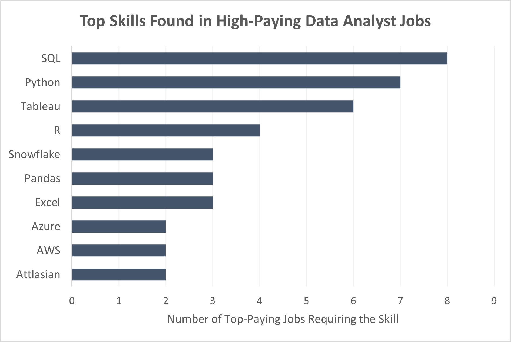
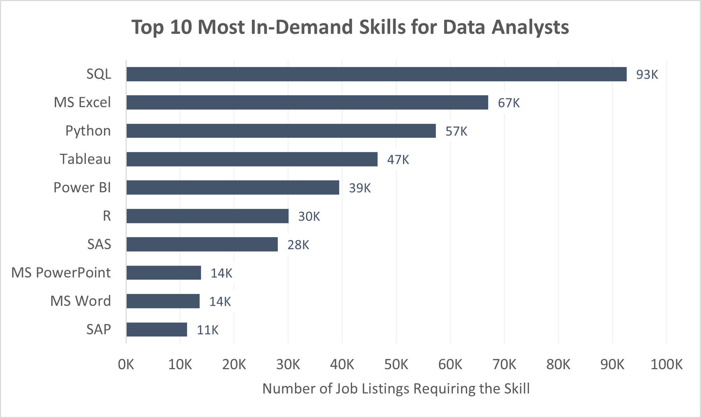
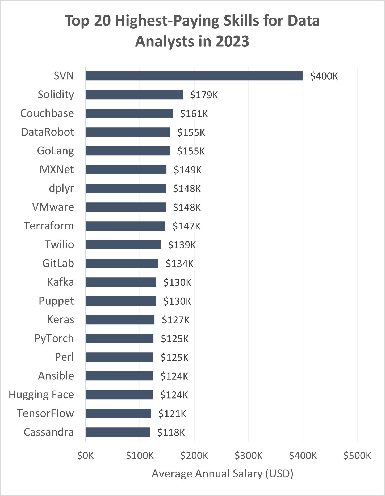
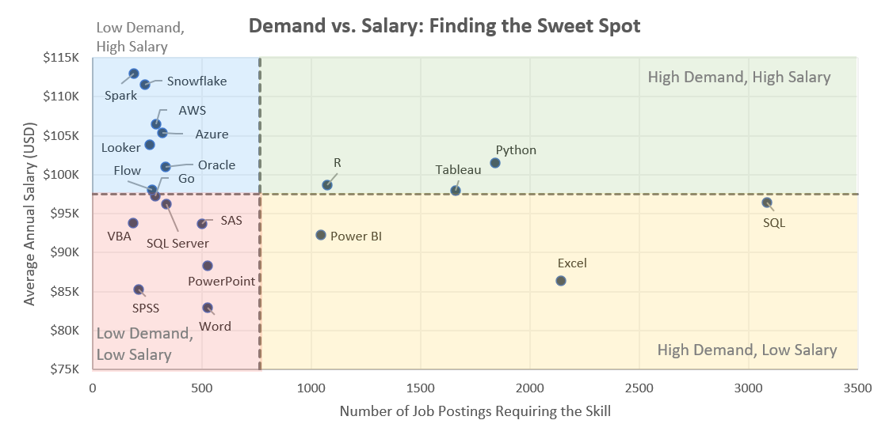

# SQL Data Analyst Project: Job Market Analysis  

# 📌 Introduction

🚀 **Dive into the data job market!** This project analyzes data analyst job postings from 2023 to uncover key insights about salaries, required skills, and industry trends. Using SQL, I explore:  

- 💰 **What are the top-paying jobs for data analysts?**  
- 🛠 **What skills are required for these high-paying roles?**  
- 📈 **What are the most in-demand skills in the industry?**  
- 🔍 **Which skills correlate with higher salaries?**  
- 🎯 **What are the most optimal skills to learn?** (*High demand & high pay!*)  

By breaking down job listings, this analysis helps aspiring and current data analysts understand market trends and make data-driven career decisions.

🔎 Check the SQL queries here: [**project_sql**](./project_sql/)

📌 Dataset Source: [Luke Barousse](https://www.youtube.com/@LukeBarousse)'s SQL course on YouTube, which he also uses to build [Data Nerd Tech](https://datanerd.tech/).

# 📊 Background
The demand for data analysts continues to grow, but not all roles offer the same opportunities. Some positions pay significantly more, while certain skills are more in demand than others. This project aims to answer:

- 💰 **What are the top-paying jobs for data analysts?**
- 🛠 **What skills are required for these high-paying roles?**
- 📈 **What are the most in-demand skills in the industry?**
- 🔍 **Which skills correlate with higher salaries?**
- 🎯 **What are the most optimal skills to 
learn?** (*High demand & high pay!*)

By analyzing job postings, this project helps identify the most valuable skills and career paths for data analysts in 2023.

## 🛠 Tools I Used  

For this project, I used the following tools to analyze job posting data efficiently:  

- **SQL** – To query, clean, and analyze job market data  
- **PostgreSQL** – The relational database used to store and manage data  
- **VS Code** – The code editor for writing and editing SQL queries  
- **Git & GitHub** – For version control, collaboration, and sharing the project  

These tools helped streamline the data exploration process, ensuring efficient querying and reproducibility.  

# The Analysis

## 1. 💰 Top Paying Data Analyst Job

### 🔍 What I Did  
To identify the highest-paying data analyst roles in 2023, I queried job postings and ranked them based on their **average annual salary**. The dataset includes information such as **company name, job title, salary, location, job posting platform, and posting date**.  

```sql
SELECT 
    jobs.job_id,
    company.company_id,
    company.name AS company_name,
    jobs.job_title,
    jobs.job_location,
    jobs.job_via,
    jobs.job_schedule_type,
    jobs.job_posted_date,
    jobs.salary_year_avg
FROM job_postings_fact AS jobs
LEFT JOIN company_dim AS company 
    ON jobs.company_id = company.company_id
WHERE jobs.job_title_short = 'Data Analyst'
    AND jobs.job_location = 'Anywhere'
    AND jobs.salary_year_avg IS NOT NULL
ORDER BY jobs.salary_year_avg DESC
LIMIT 10;
```

| **company_name**                        | **job_title**                                   | **job_via**      | **job_schedule_type** | **job_posted_date** | **salary_year_avg** |
|-----------------------------------------|-------------------------------------------------|------------------|-----------------------|---------------------|---------------------|
| Mantys                                  | Data Analyst                                    | via Y Combinator | Full-time             | 2023-02-20          | 650000.0            |
| Meta                                    | Director of Analytics                           | via LinkedIn     | Full-time             | 2023-08-23          | 336500.0            |
| AT&T                                    | Associate Director- Data Insights               | via ZipRecruiter | Full-time             | 2023-06-18          | 255829.5            |
| Pinterest Job Advertisements            | Data Analyst, Marketing                         | via Indeed       | Full-time             | 2023-12-05          | 232423.0            |
| Uclahealthcareers                       | Data Analyst (Hybrid/Remote)                    | via Recruit.net  | Full-time             | 2023-01-17          | 217000.0            |
| SmartAsset                              | Principal Data Analyst (Remote)                 | via Built In NYC | Full-time             | 2023-08-09          | 205000.0            |
| Inclusively                             | Director, Data Analyst - HYBRID                 | via Indeed       | Full-time             | 2023-12-07          | 189309.0            |
| Motional                                | Principal Data Analyst, AV Performance Analysis | via LinkedIn     | Full-time             | 2023-01-05          | 189000.0            |
| SmartAsset                              | Principal Data Analyst                          | via Indeed       | Full-time             | 2023-07-11          | 186000.0            |
| Get It Recruit - Information Technology | ERM Data Analyst                                | via Get.It       | Full-time             | 2023-06-09          | 184000.0            |

*Query result showing the top 10 highest paying remote data analyst job. Showing  less columns from the query to make the result fit within the page*


### 📊 Insights from the Data  
- Senior and leadership roles (e.g., Director of Analytics, Principal Data Analyst, Associate Director - Data Insights) tend to offer the highest salaries.

- Remote and hybrid roles are common among top-paying jobs, indicating that high salaries don’t necessarily require in-office presence.

- In-demand specializations, such as marketing analytics and risk management, appear among the highest-paying roles.

This analysis highlights trends in salary distribution for data analysts and helps identify career growth opportunities in the field.

### 2. 🛠 Skills Required for Top-Paying Data Analyst Roles

### 🔍 What I Did  
To understand which skills are most valuable in **high-paying** data analyst jobs, I extracted and analyzed the required skills from the **top-paying job postings** identified in the previous step. The result highlights the **most frequently mentioned** skills in these roles.  

```sql
WITH top_paying_jobs AS (
    SELECT 
        job_id
    FROM job_postings_fact AS jobs
    WHERE job_title_short = 'Data Analyst'
        AND job_location = 'Anywhere'
        AND salary_year_avg IS NOT NULL
    ORDER BY salary_year_avg DESC
    LIMIT 10
)

SELECT 
    skills.skills AS skill_name,
    COUNT(*) AS skill_count
FROM top_paying_jobs AS jobs
JOIN skills_job_dim AS skills_to_job 
    ON jobs.job_id = skills_to_job.job_id
JOIN skills_dim AS skills 
    ON skills_to_job.skill_id = skills.skill_id
GROUP BY skills.skills
ORDER BY skill_count DESC, 
         skill_name
LIMIT 10;
```



*Image showing the top skills found in the high-paying data analyst job from the first question.*

### 📊 Insights from the Data  
- **SQL is the most in-demand skill** among top-paying roles, appearing in **80%** of job postings.  
- **Python and Tableau** are also highly valued, reinforcing the importance of both programming and data visualization skills.  
- **R, Excel, and Pandas** are commonly mentioned, indicating the need for both statistical analysis and data manipulation expertise.  
- **Cloud platforms like Snowflake, AWS, and Azure** appear in multiple listings, suggesting that familiarity with cloud-based data solutions is becoming increasingly valuable.  
- **Atlassian tools** (such as Jira and Confluence) are listed in some job postings, hinting at the importance of collaboration and project management skills. 

This analysis provides a **clear roadmap for data analysts looking to land high-paying roles**, emphasizing the need for **SQL, Python, Tableau, and cloud technologies**.  

## 3. 📈 Most In-Demand Skills for Data Analysts  

### 🔍 What I Did  
To identify the **most in-demand** skills for data analysts, I analyzed job postings to count how often each skill was mentioned as a requirement. This reveals which skills are the most sought-after by employers in the job market.  

```sql
SELECT 
    skills.skills AS skill_name,
    COUNT(skills.skill_id) AS demand_count
FROM job_postings_fact AS jobs 
JOIN skills_job_dim AS skills_to_job 
    ON jobs.job_id = skills_to_job.job_id
JOIN skills_dim AS skills 
    ON skills_to_job.skill_id = skills.skill_id
WHERE jobs.job_title_short = 'Data Analyst'
GROUP BY skills.skills
ORDER BY demand_count DESC
LIMIT 10;
```



*Showing the most in-demand skills for data analyst in 2023*

### 📊 Insights from the Data
1. **SQL, Excel, and Python dominate the job market** – SQL appears in **92K+ job postings**, followed by **Excel (67K+)** and **Python (57K+)**, confirming their essential role in data analysis.  
2. **Data visualization is highly valued** – Tools like **Tableau (46K+) and Power BI (39K+)** highlight the importance of **presenting insights effectively**.  
3. **Business and enterprise tools matter** – Skills like **PowerPoint, Word, and SAP** indicate that **communication, reporting, and ERP knowledge** are also valuable in the field.  

This analysis provides a **clear roadmap for aspiring data analysts**, focusing on the skills that **maximize job opportunities** in the field.  

## 4. 💰 Top Skills Based on Salary

### 🔍 What I Did

To determine which skills are associated with the highest salaries, I analyzed job postings and extracted the average salary for each skill mentioned. This helps identify high-value technical skills for data analysts.

```sql
SELECT 
    skills.skills AS skill_name,
    ROUND(AVG(jobs.salary_year_avg), 0) AS salary_year_avg
FROM job_postings_fact AS jobs 
JOIN skills_job_dim AS skills_to_job 
    ON jobs.job_id = skills_to_job.job_id
JOIN skills_dim AS skills 
    ON skills_to_job.skill_id = skills.skill_id
WHERE jobs.job_title_short = 'Data Analyst'
    AND jobs.salary_year_avg IS NOT NULL
GROUP BY skills.skills
ORDER BY salary_year_avg DESC
LIMIT 20;
```



*Figure showing the highest paying skills for data analyst in 2023*

### 📊 Insights from the Data

**Specialization is Key to Higher Salaries**
-   The presence of niche technologies like **SVN, Solidity, and DataRobot** suggests that highly specialized knowledge in emerging fields commands premium salaries.
-   The mix of **AI, DevOps, Cloud, and Big Data** tools suggests that data analysts who go beyond basic SQL and Python skills can significantly increase their earning potential.


## 5. 📈 Skills That Balance High Demand & High Pay

### 🔍 What I Did
I analyzed both demand and salary data to find skills that offer a balance between job opportunities and high pay for data analysts. This helps identify which skills provide the best career prospects.

```sql
SELECT 
    skills.skill_id,
    skills.skills AS skill_name,
    COUNT(skills.skill_id) AS demand_count,
    ROUND(AVG(jobs.salary_year_avg), 0) AS annual_salary_avg_usd
FROM job_postings_fact AS jobs 
JOIN skills_job_dim AS skills_to_job 
    ON jobs.job_id = skills_to_job.job_id
JOIN skills_dim AS skills 
    ON skills_to_job.skill_id = skills.skill_id
WHERE jobs.job_title_short = 'Data Analyst'
    AND jobs.salary_year_avg IS NOT NULL
GROUP BY skills.skill_id, skill_name
HAVING COUNT(skills.skill_id) > 100
ORDER BY demand_count DESC;
```



*This scatter chart visualizes the relationship between skill demand and average salary for data analysts. The chart is divided into four quadrants, categorizing skills based on their demand in the job market and associated salary levels.*

### 📊 Insights from the Data

### **New Insights from the Quadrant Analysis**  

Analyzing the scatter plot of skill demand vs. salary reveals several strategic takeaways for an aspiring data analyst:  

1. **The "Sweet Spot" – SQL, Python, and Tableau**  
   - These skills fall in the high-demand and high-salary quadrant, making them excellent investments.  
   - SQL remains the most in-demand skill, while Python and Tableau command strong salaries, making them a powerful trio to master.  

2. **Business Intelligence (BI) Tools: High Demand, Moderate Salary**  
   - **Power BI and Tableau** are widely used in analytics but offer moderate salaries compared to programming-focused skills.  
   - This suggests that BI skills are essential for reporting roles but should be complemented with SQL or Python to maximize career growth.  

3. **Niche Technologies = High Pay, Low Demand**  
   - Skills like **Spark, Terraform, and Snowflake** offer some of the highest salaries but are not as commonly required.  
   - Learning these can be a smart move if targeting specialized roles in data engineering or cloud analytics.  

4. **Foundational Office Tools Still Matter**  
   - **Excel, PowerPoint, and Word** remain relevant but fall into the high-demand, lower-salary quadrant.  
   - While they won’t differentiate a data analyst, they are still expected skills for business reporting.  

5. **Low-Demand, Low-Salary Skills – Not Worth the Investment**  
   - Some skills, like **Outlook and SharePoint**, do not offer strong salary incentives or demand in analytics roles.  
   - For career growth, prioritizing technical skills over administrative tools is a better approach.  

## 📚 **What I Learned from This Project**  

1. **Breaking Down Complex Questions into SQL Queries**  
   - This project required **extracting insights from a large dataset**, so I had to break down each question into smaller, manageable SQL queries.  
   - I used **CTEs and subqueries** to structure my queries efficiently, especially when calculating demand, salaries, and skill occurrences across different job roles.  

2. **Using Aggregate Functions to Derive Insights**  
   - To find the most in-demand skills and highest-paying skills, I applied **COUNT() and AVG() functions**, grouping data based on skills and job roles.  
   - **ORDER BY and LIMIT** helped in ranking results, ensuring I could identify the top skills efficiently.  

3. **Combining Multiple Tables with Joins**  
   - Since the data was spread across different tables (skills, salaries, job postings), I used **INNER JOINs and LEFT JOINs** to merge relevant data.  
   - This approach allowed me to **connect salary data with skill demand**, providing a comprehensive view of which skills offer the best balance of demand and salary.  

4. **Filtering and Optimizing Queries for Better Performance**  
   - Using **WHERE clauses** helped filter relevant data, especially when focusing on specific job roles like "Data Analyst."  
   - **Indexing and optimizing queries** became essential as some tables contained large amounts of data, ensuring the queries ran efficiently.  

5. **Deriving Business Insights from Raw Data**  
   - Beyond just writing queries, I learned how to **interpret results in a meaningful way**, turning raw numbers into actionable insights.  
   - This reinforced the importance of **aligning SQL analysis with business objectives**, ensuring the findings are useful for decision-making.  

This project strengthened my ability to **write complex SQL queries, optimize performance, and extract meaningful insights from structured data**—valuable skills for any data analyst role! 🚀

# Conclusions

Through this project, I explored various aspects of data analyst job trends using SQL, uncovering key insights about salaries, skill demand, and their relationship. Here are five of the most interesting findings:  

1.  **SQL is the Most In-Demand Skill** – Across job listings, SQL consistently appeared as the most sought-after skill, reinforcing its importance for data analysts. Excel and Python followed closely, emphasizing the need for both technical and business-oriented tools.  

2.  **Python and SQL Lead in High-Paying Roles** – While SQL is the most in-demand, Python frequently appears in top-paying data analyst jobs. This suggests that analysts with programming expertise can access higher-paying opportunities.  

3.  **High Salaries Often Come from Specialized or Niche Skills** – Some of the highest-paying skills, such as **Solidity, Terraform, and DataRobot**, are not as commonly required but command premium salaries, likely due to their specialized nature.  

4. **Demand Doesn’t Always Correlate with Salary** – Skills like **Power BI and Tableau** are highly in demand but don’t necessarily offer the highest salaries. Meanwhile, niche technologies like **Snowflake and Spark** have fewer job postings but offer higher compensation.  

5. **Identifying the Best Skill Investment** – Based on the quadrant analysis, skills like **SQL, Python, and Snowflake** offer a strong balance of demand and salary, making them valuable choices for career development.  

These insights help in making data-driven decisions about which skills to prioritize for career growth in data analytics. 🚀
